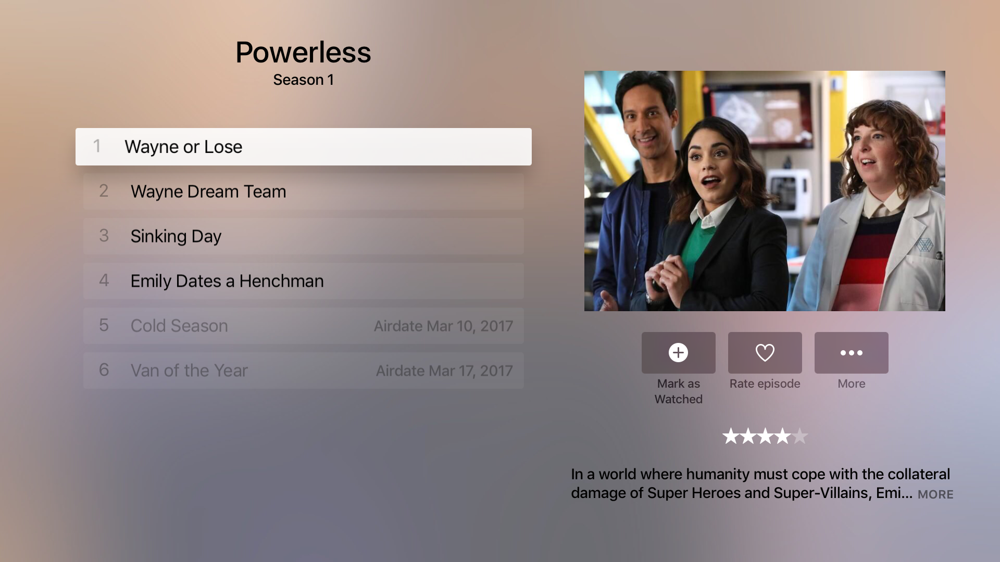

# TVML app for soap4.me

[](https://circleci.com/gh/a-ignatov-parc/tvos-soap4.me)

This is proof of concept application written with help of [TVDML](https://github.com/a-ignatov-parc/tvdml) library using javascript and TVML support provided by [TVMLKit](https://developer.apple.com/reference/tvmlkit) in tvOS starting from tvOS 9.0. It uses [soap4.me](https://soap4.me/) api to show information about tv shows.

> Application is written for tvOS 11 and may have some UI issues in previous tvOS releases.

## Building project

In order to run TVML application localy you will have to build source code and serve result with web-server. Luckily this repo already includes all necessary tools.

The only requirement is installed lts version of node.js and npm.

> You can install proper version of node.js using [nvm](https://github.com/creationix/nvm) with `nvm use`.

To install everything you need to start and running this application type following command in terminal

```
npm run install-deps
```

And wait until it's done.

Next step is to build and serve TVML application. You can do this with following command:

```
npm run serve
```

Now you can build Xcode project and run it in simulator or on Apple TV.

## Application


This application is available as [`soap4atv`](https://itunes.apple.com/ru/app/id1204973085) in the Apple's App Store.

### Screenshots




