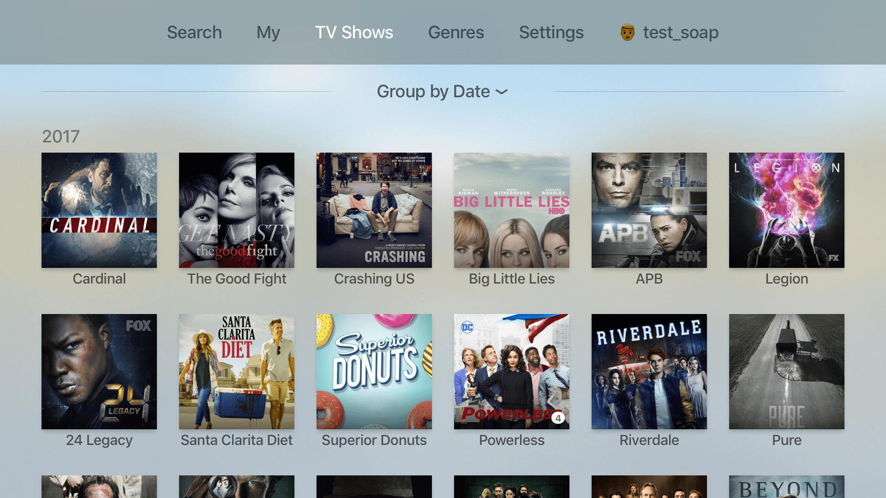

# TVML app for soap4.me

This is proof of concept application written with help of [TVDML](https://github.com/a-ignatov-parc/tvdml) library using javascript and TVML support provided by [TVMLKit](https://developer.apple.com/reference/tvmlkit) in tvOS starting from tvOS 9.0. It uses [soap4.me](https://soap4.me/) api to show information about tv shows.

> Application was written for tvOS 10 and may have some UI issues in previous tvOS releases.

## Building project

In order to run TVML application localy you will have to build and serve result from web-server. You can do this using prepared [gulp.js](http://gulpjs.com/) tasks. But first you'll need to have installed node.js with npm.

To install dependencies execute the folowing commands in terminal

```
npm install -g gulp
npm install
```

To build and serve TVML application using run web-server run

```
gulp serve
```

Now you can build Xcode project and run it in simulator or on Apple TV.

## Application


This application is available as [`soap4atv`](https://itunes.apple.com/ru/app/id1204973085) in the Apple's App Store.

### Screenshots



